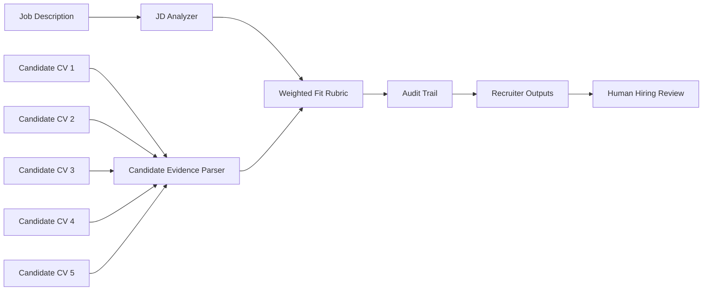
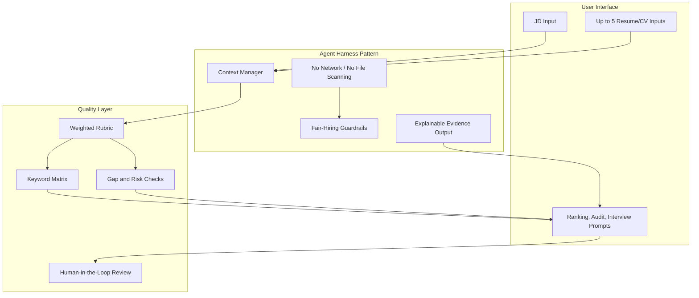
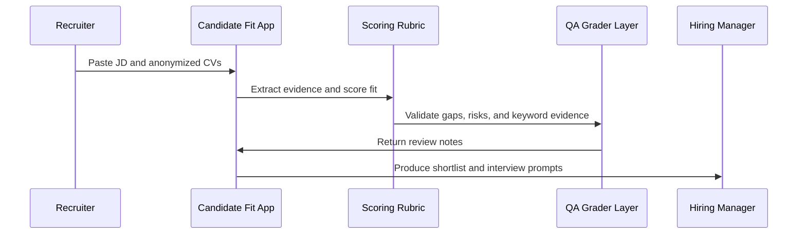
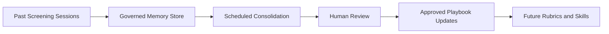
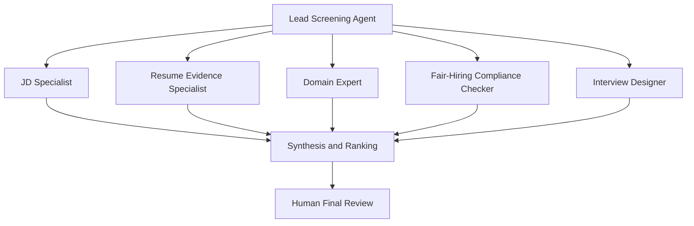

# Enterprise AI Candidate Fit & Agent Harness Showcase

A privacy-first, standalone HTML demo that compares up to five anonymized candidate resumes or CVs against one job description, ranks fit, explains evidence, highlights gaps, and produces recruiter-ready review outputs.

This is intentionally framed as more than an HR utility. It is a compact portfolio artifact for leadership roles spanning AI transformation, solution architecture, operating model design, and corporate AI governance.

The point of the project is to show how a real business workflow can become a governed AI-style application: bounded context, visible controls, explicit rubrics, explainable outputs, human review, and a roadmap toward agent orchestration.

## What Employers Should Notice

- Business-to-AI translation: a messy recruiting workflow is converted into a structured decision-support system.
- Agent harness thinking: the app constrains inputs, tools, actions, data movement, and outputs before any AI model is introduced.
- Governance by design: human review, fair-hiring guardrails, auditability, and no autonomous employment decisions.
- Outcome-driven engineering: fit is judged against a visible rubric, not vague prompt output.
- Enterprise roadmap: the same pattern can scale to grader agents, specialist subagents, governed memory, reusable skills, advisor models, and scheduled routines.

## Public-Safe Design

This public version contains:

- No private resume data.
- No personal career modules.
- No folder scanning.
- No API keys.
- No live AI calls.
- No external tracking.

It uses synthetic candidate examples and deterministic browser-side scoring.

## Demo Workflow

The app does not make hiring decisions. It creates a structured screening brief that a recruiter, hiring manager, or talent partner can challenge and review.

## Architecture Pattern

## Scoring Model

The static app uses deterministic text analysis rather than a model call.

| Component | Weight | Purpose |
|---|---:|---|
| Skill coverage | 25 | Checks whether top JD signals appear in each resume or CV |
| Domain fit | 20 | Measures role-family and industry overlap |
| Role evidence | 20 | Rewards concrete responsibility and action evidence |
| Seniority | 15 | Compares candidate scope against role level |
| Metrics proof | 10 | Rewards quantified achievements |
| Location fit | 5 | Checks geography and regional context |
| Risk adjustment | 5 | Flags visible gaps, weak evidence, or seniority mismatch |

## Corporate AI Concepts Demonstrated

### 1. Core Architecture And Governance

**Agent harness**

The harness is the software execution layer around an AI model: context management, permissions, tools, memory rules, logging, and safety controls. In this demo, the harness is represented by a bounded browser app with no network calls, no hidden file reads, and no autonomous actions.

**Lifecycle hooks and sandboxing**

Production agents should intercept high-risk actions before execution. This demo shows the same pattern in simplified form: input validation, scoring, risk checks, report generation, and explicit human review.

### 2. Quality Control And Verification

**Outcomes and rubrics**

The scoring rubric defines what "fit" means before candidates are ranked. This turns a vague AI instruction into measurable success criteria.

**Grading agents**

In a full enterprise version, a separate grader agent would review the primary matching output against the rubric before a recruiter sees it. This demo keeps grading deterministic and visible, but the architecture is ready for a maker-checker workflow.

### 3. Continuous Learning And Memory

**Memory stores**

A production version could retain approved role templates, company-specific rubrics, recruiter preferences, and calibration feedback. For public safety, this demo stores nothing persistently.

**Dreaming / memory consolidation**

An enterprise deployment could run scheduled consolidation to identify common false positives, rejected weak signals, recurring missing skills, and rubric drift. Consolidated lessons should be reviewed before promotion into shared memory.

### 4. Orchestration And Execution

**Multi-agent orchestration**

A larger corporate version could split screening into specialist agents: JD analyst, resume parser, domain expert, compliance checker, compensation benchmarker, and interview designer.

**Advisor pattern**

A lower-cost model could handle routine parsing while a stronger model advises on ambiguous seniority, transferability, or risk-heavy decisions.

**Skills**

Reusable skill packages could encode corporate hiring rules, role-family taxonomies, interview guides, regulatory constraints, and industry-specific scoring rubrics.

**Routines**

Scheduled routines could run screening batches, refresh candidate dashboards, or perform weekly calibration reviews, while keeping humans responsible for final decisions.

## Fair-Hiring Guardrails

This demo is a screening aid, not an automated hiring system.

- It should not infer or score protected characteristics.
- It should not reject candidates without human review.
- It should not process private resumes without consent.
- It should not be used as the only basis for employment decisions.
- It should be calibrated against real hiring outcomes before production use.

## Run Locally

Open `index.html` directly in a browser.

No build step is required. No dependencies are required.

## Suggested Repository Positioning

Suggested repo name:

`candidate-fit-showcase`

Suggested description:

`Governed candidate-to-JD matching demo showcasing agent harness design, explainable scoring, and corporate AI architecture.`

Suggested topics:

`ai-apps`, `solution-architecture`, `agentic-engineering`, `hr-tech`, `candidate-matching`, `governance`, `explainable-ai`, `standalone-html`

## Roadmap

- Enable GitHub Pages for a one-click live demo.
- Add optional JSON import/export for candidate batches.
- Add configurable rubrics by role family.
- Add anonymization checks before scoring.
- Add a separate QA grader pass.
- Add salary evidence checklist as non-decision support.
- Add enterprise version with governed memory, audit logs, and role-based permissions.

## Important Note

This project is a public showcase of architecture and workflow design. It deliberately avoids private data, live model calls, hidden file access, and autonomous hiring decisions.
