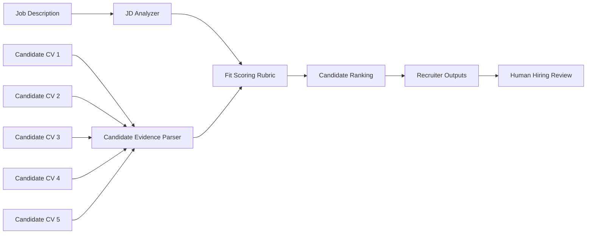
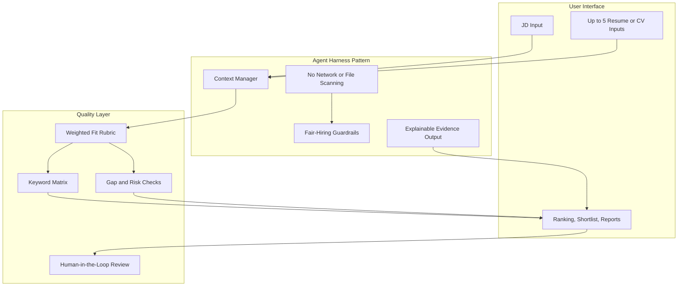
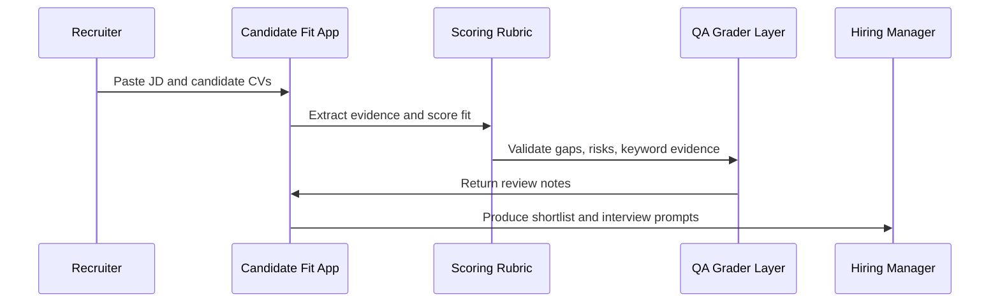
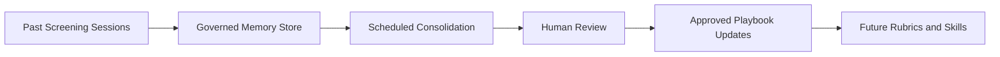
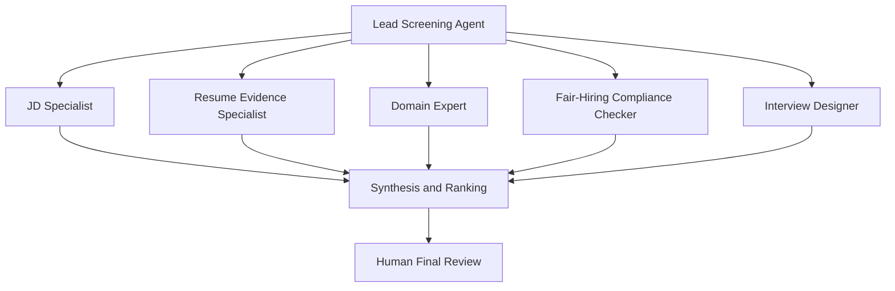

# Candidate Fit Showcase

A privacy-first, standalone HTML demo for comparing up to five candidate resumes or CVs against one job description. The app is intentionally simple to run, but the README frames it as a solution-architecture showcase for governed corporate AI applications.

This public version contains no private resume data, no personal career modules, no folder scanning, no API keys, and no live AI calls. It demonstrates the product pattern: structured inputs, deterministic scoring, explainable evidence, recruiter guardrails, and copy-ready hiring outputs.

## What This Showcases

- Solution architecture: converting a business workflow into a governed, auditable decision-support app.
- AI application design: separating inputs, scoring, evidence extraction, quality checks, and human review.
- Corporate AI governance: using clear guardrails, measurable rubrics, and human-in-the-loop decision points.
- Agentic engineering thinking: the model is not the product; the harness, controls, workflow, and auditability are the product.

## Demo Workflow

The app does not make hiring decisions. It creates a structured screening brief that a recruiter, hiring manager, or talent partner can review.

## Architecture Pattern

## Corporate AI Design Concepts

### 1. Core Architecture And Governance

**Agent harness**

In enterprise AI, the harness is the execution layer around the model: context management, permissions, tools, memory rules, logging, and safety controls. In this demo, the harness is represented by a bounded browser app with no network calls, no hidden file reads, and no autonomous actions.

**Lifecycle hooks and sandboxing**

Production agents should intercept high-risk actions before execution. This demo shows the same pattern in simplified form: the app only analyzes pasted text and outputs review material. It does not transmit data, mutate files, or make final hiring decisions.

### 2. Quality Control And Verification

**Outcomes and rubrics**

The scoring rubric defines what fit means before candidates are ranked. Each candidate is scored across skill coverage, domain fit, role evidence, seniority, metrics proof, location fit, and risk adjustment.

**Grading agents and outsourced graders**

In a full enterprise version, a separate grading agent would review the primary matching output against a rubric before a recruiter sees it. This demo keeps grading deterministic and visible, but the architecture is ready for a maker-checker workflow.

### 3. Continuous Learning And Memory

**Memory stores**

A production version could retain approved role templates, company-specific rubrics, recruiter preferences, and past calibration feedback. For public safety, this demo stores nothing persistently.

**Dreaming and memory consolidation**

In an enterprise deployment, scheduled background review could consolidate lessons from prior screenings: common false positives, rejected weak signals, recurring missing skills, and rubric drift. This is intentionally not active in the static demo, but the README documents the pattern.

### 4. Orchestration And Execution

**Multi-agent orchestration and subagents**

A larger corporate version could split screening into specialist agents: JD analyst, resume parser, domain expert, compliance checker, compensation benchmarker, and interview designer. This mirrors microservices for cognition, where each subagent has a narrow scope and isolated context.

**Advisor tool pattern**

For cost control, a cheaper model could handle routine parsing while a stronger model advises only on ambiguous seniority, domain transferability, or risk-heavy decisions.

**Skills**

Reusable SKILL.md packages could encode corporate hiring rules, role-family taxonomies, interview guides, regulatory constraints, and industry-specific scoring rubrics.

**Routines**

Scheduled routines could run nightly screening batches, refresh candidate dashboards, or perform weekly calibration reviews, while keeping humans responsible for final decisions.

## How The Demo Scores Candidates

The static app uses deterministic text analysis rather than an AI model.

| Component | Weight | Purpose |
|---|---:|---|
| Skill coverage | 25 | Checks whether top JD keywords appear in the resume or CV |
| Domain fit | 20 | Measures role-family and industry overlap |
| Role evidence | 20 | Rewards action verbs and evidence of responsibility |
| Seniority | 15 | Compares candidate scope against role level |
| Metrics proof | 10 | Rewards quantified achievements |
| Location fit | 5 | Checks geography and regional context |
| Risk adjustment | 5 | Flags visible gaps, weak evidence, or seniority mismatch |

## Fair-Hiring Guardrails

This demo is a screening aid, not an automated hiring system.

- It should not infer or score protected characteristics.
- It should not reject candidates without human review.
- It should not process private resumes without consent.
- It should not be used as the only basis for employment decisions.
- It should be calibrated against real hiring outcomes before production use.

## Run Locally

Open index.html directly in a browser.

No build step is required. No dependencies are required.

## Suggested Repository Positioning

Recommended repo name: candidate-fit-showcase

Suggested description: Standalone recruiter workflow demo for explainable candidate-to-JD matching, built as a corporate AI solution architecture showcase.

Suggested topics: ai-apps, solution-architecture, agentic-engineering, hr-tech, candidate-matching, governance, explainable-ai, standalone-html

## Roadmap

- Add optional JSON import and export for candidate batches.
- Add configurable rubrics by role family.
- Add anonymization assistant before scoring.
- Add separate QA grader pass.
- Add salary evidence checklist as a non-decision support module.
- Add enterprise version with governed memory, audit logs, and role-based permissions.

## Important Note

This project is a public showcase of architecture and workflow design. It deliberately avoids private data, live model calls, hidden file access, and autonomous hiring decisions.
